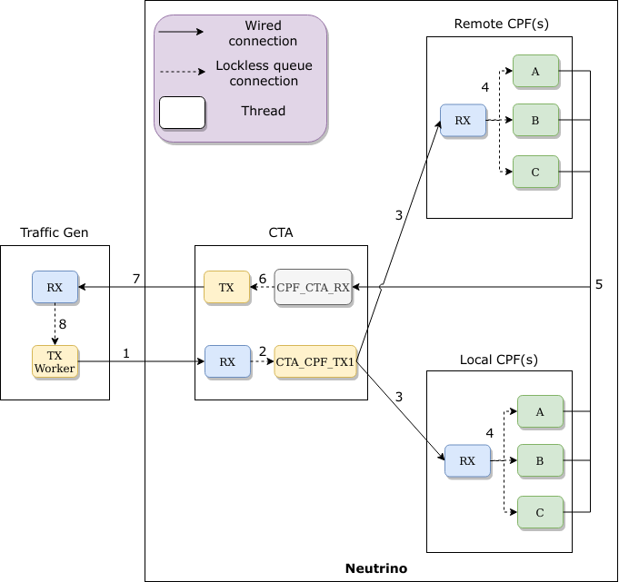
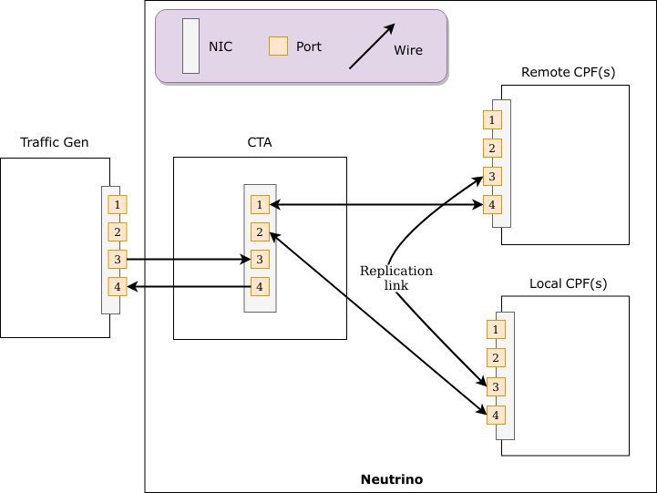
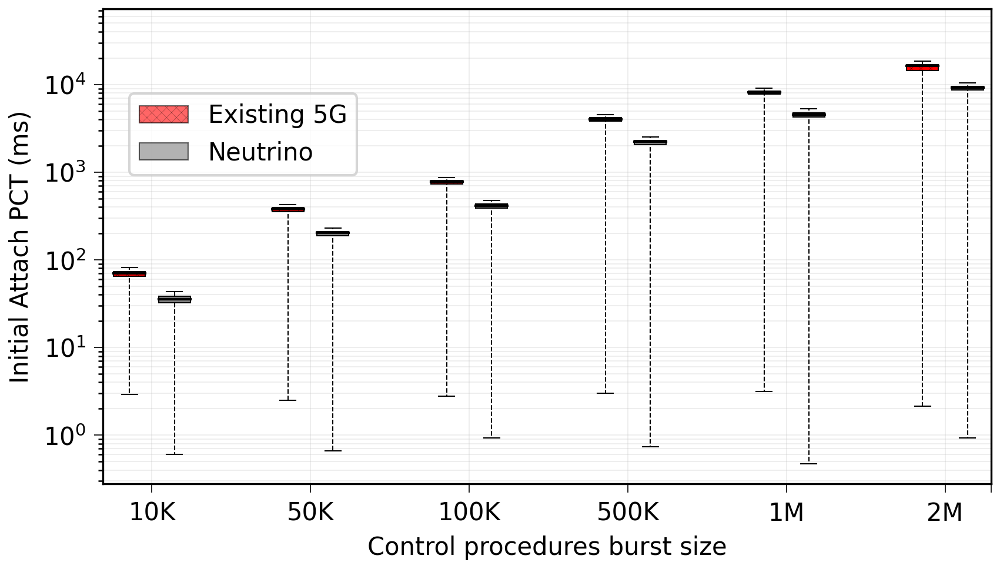
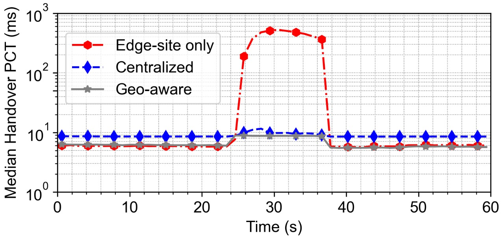

# :atom_symbol: Neutrino :atom_symbol:
## Overview
The README explains how to setup and configure Neutrino for experiements. We briefly provide system level overview of the Neutrino.
The README is divided into three sections:
1. [System overview](#system-overview)
2. [System setup](#system-setup) 
3. [Experiments execution](#experiments-execution)  

## System overview
<div align="center" id="fig1">
    
    <p>&nbsp;&nbsp;&nbsp;&nbsp;&nbsp;&nbsp;&nbsp;&nbsp;&nbsp;&nbsp;&nbsp;&nbsp;&nbsp;&nbsp;&nbsp;&nbsp;&nbsp;&nbsp;&nbsp;&nbsp;&nbsp;&nbsp;&nbsp;&nbsp;&nbsp;&nbsp;&nbsp;&nbsp;&nbsp;&nbsp;&nbsp;&nbsp;Fig 1: Simplified Neutrino experimental setup</p>
</div>

[Figure 1](#fig1) shows the simplified Neutrino experimental setup. As depicted in the figure, the system has three components -- Control Traffic Generator, Control Traffic Aggregator (CTA) and Control Plane Function (CPF). Brief explanation of each component is given below.

### Control Traffic Generator
The control traffic generator simulates both User Equipment (UE) and Base Station (BS). The control traffic genenrator in our case replays the real control traces of the control procedures such as Initial Attach, Handover and Service Establishment. As shown in the figure, there are two types of threads in the control traffic generator: TX Worker threads and RX thread. TX worker threads are responsible for starting the control procedures in either uniform or bursty mode. The RX thread is in control of receiving the response messages from the CTA. Once the RX thread receives messages from the CTA, it forwards them to a specific TX Worker thread via lockless queues. The TX Worker thread then prepares and sends the next message of the procedure to the CTA.

Links to the control traffic generator functions from the [Fig 1](#fig1), 
- [RX](https://github.com/nsgLUMS/neutrino/blob/4b83f4544c76086af48f15e34e23c5bb174b259b/pktgen/main.c#L446)
- [TX Workers (uniform)](https://github.com/nsgLUMS/neutrino/blob/4b83f4544c76086af48f15e34e23c5bb174b259b/pktgen/main.c#L257) and [TX Workers (bursty)](https://github.com/nsgLUMS/neutrino/blob/4b83f4544c76086af48f15e34e23c5bb174b259b/pktgen/main.c#L361) 

### Control Traffic Aggregator (CTA)
CTA in our design represents a load balancer with some additional functionalities. The CTA is responsible for (i) message logging, (ii) forwarding traffic to/from appropriate CPF, and (iii) CPF failure detection and recovery. It has two communication paths: 1). Control Traffic Generator to CPFs 2). CPFs to Control Traffic Generator. The first path, Control Traffic Generator to CPFs, has two types of threads: RX and TX threads. RX thread is responsible for receiving messages from the Control Traffic Generator, rate measurement and the selection of either local or remote CPF pool. The TX threads receive messages from the RX thread and forward it to an appropriate CPF. The CTA uses DPDK APIs for CTA to CPFs communication. The second path is responsible for the reception of messages from the CPFs. A single RX thread receives the messages from the CPFs and forwards them to the TX thread. TX thread is only responsible for sending the messages back to the Control Traffic Generator via a DPDK APIs.

Links to the CTA functions from the [Fig 1](#fig1),
 - [RX](https://github.com/nsgLUMS/neutrino/blob/4b83f4544c76086af48f15e34e23c5bb174b259b/cta/main.c#L379) 
 - [CTA_CPF_TXs](https://github.com/nsgLUMS/neutrino/blob/4b83f4544c76086af48f15e34e23c5bb174b259b/cta/main.c#L306) 
 - [CPF_CTA_RX](https://github.com/nsgLUMS/neutrino/blob/4b83f4544c76086af48f15e34e23c5bb174b259b/cta/main.c#L68) 
 - [TX](https://github.com/nsgLUMS/neutrino/blob/4b83f4544c76086af48f15e34e23c5bb174b259b/cta/main.c#L119) 

### Control Plane Function (CPF)
CPF in our design represents Access and Mobility Management Function (AMF) and Session Management Function (SMF) in 5G system architecture. The CPF implements state machines for both NAS and NGAP procedures. As depicted in the figure, RX thread receives messages from the CTA through DPDK APIs, forwards them to apporpirate CPF and after processing the message, the CPF return response to CTA. 

The figure also shows two types of CPFs: Local and Remote. The local CPFs repsents CPFs at the edge. Remote CPFs represent the CPFs in a centralized deployment. The remote CPFs emulates propagation delay from CTA and CPF (and vice versa). Local and Remote CPFs are deployed on seperate servers in our evaluation.

Links to the CPFs functions from the [Fig 1](#fig1), 
- [RX](https://github.com/nsgLUMS/neutrino/blob/4b83f4544c76086af48f15e34e23c5bb174b259b/cpf/main.c#L176) 
- [CPFs](https://github.com/nsgLUMS/neutrino/blob/4b83f4544c76086af48f15e34e23c5bb174b259b/cpf/src/workers/workers.cpp#L231) 

## System Setup

As shown in [Figure 1](#fig1), four servers are required for Neutrino setup. Our test setup consists of servers running Ubuntu 18.04.3 with kernel 4.15.0-74-generic. Each server is a dual-socket with 18 cores per socket, Intel Xeon(R) Gold 5220 CPU @ 2.20 GHz, and with a total memory of 128 GB. All servers are also equipped with Intel X710 40 Gb (4 x 10) NIC. 

Below are required steps to run Neutrino:
1. [Cables and Ports configuration](#cables-and-ports-configuration)
2. [DPDK setup](#dpdk-setup) 
3. [External libraries](#external-libraries) 
4. [Neutrino setup](#neutrino-setup)
5. [Servers configuration](#servers-configuration)

## Cables and Ports Configuration

[Figure 2](#fig2) shows default NIC ports configuration used in Neutrino which can be updated from the code. We have used [10 Gb SFP + ethernet cables](https://www.connection.com/product/extreme-networks-10-gigabit-ethernet-sfp-passive-cable-1m/10304/16268319). Code for [Control Traffic Generator](https://github.com/nsgLUMS/neutrino/blob/2c6f4fb2f1b5e1826a8ca2c90a2bfd686f38a6a5/pktgen/helper/globals.h#L12), [CTA](https://github.com/nsgLUMS/neutrino/blob/2c6f4fb2f1b5e1826a8ca2c90a2bfd686f38a6a5/cta/Common/globals.h#L7) and [CPF](https://github.com/nsgLUMS/neutrino/blob/2c6f4fb2f1b5e1826a8ca2c90a2bfd686f38a6a5/cpf/Common/globals.h#L9) can be accessed by clicking the relevant links.

<div align="center" id="fig2">
    
    <p>&nbsp;&nbsp;&nbsp;&nbsp;&nbsp;&nbsp;&nbsp;&nbsp;&nbsp;&nbsp;&nbsp;&nbsp;&nbsp;&nbsp;&nbsp;&nbsp;&nbsp;&nbsp;&nbsp;&nbsp;&nbsp;&nbsp;&nbsp;&nbsp;&nbsp;&nbsp;Fig 2: Cable and port configuration</p>
</div>

### DPDK Setup

Data Plane Development Kit (DPDK) is a library to accelerate the packet processing workloads. In order to install DPDK, you need to perform the following steps on all four servers:

1. Download DPDK 17.11 by running the following command: <br/> `wget https://github.com/DPDK/dpdk/archive/v17.11.tar.gz`
2. Extract the `.tar.gz` file into a folder.
3. Navigate to `dpdk-17.11/usertools`.
4. Execute `dpdk-setup.sh` file using the command: <br/>
`sudo ./dpdk-setup.sh`
5. From the `Step 1: Select the DPDK environment to build` section, select the right system architecture and compiler. For us it was _[14] x86_64-native-linuxapp-gcc_
6. Insert the driver, we used _[17] Insert IGB UIO module_
7. Setup hugepages, we used NUMA systems so _[21] Setup hugepage mappings for NUMA systems_.
The number of huge pages depends on the system's memory. We used to run experiments with 30,000 hugepages, each of 2kB. Later on, we used 1GB hugepages, a total of 100.
8. Bind ports, _[23] Bind Ethernet/Crypto device to IGB UIO module_.
9. Lastly, add the following lines to the `/etc/environment` file:
```
RTE_SDK="path_to_dpdk/dpdk-17.11"
RTE_TARGET="x86_64-native-linuxapp-gcc"
```

### External Libraries

The CTA and CPF use a C++ [Libconfig](https://github.com/hyperrealm/libconfig) library to manage the system's configuration files. In order to install it, you need to execute the following commands on their respective servers.

```
sudo apt-get update -y
sudo apt-get install -y libconfig-dev
```
### Neutrino Setup

Perform the following steps to setup Neutrino:
1. Clone the Neutrino repository on all four servers.
2. At the Control Traffic Generator server, navigate to [pktgen](https://github.com/nsgLUMS/neutrino/tree/master/src/pktgen) folder and run the following commands:
```
sudo make clean
sudo make
```
3. At the CTA server, navigate to [CTA](https://github.com/nsgLUMS/neutrino/tree/master/src/core/cta) folder and run the `sudo make clean && sudo make`.
4. Similarly, at both CPF servers, navigate to [CPF](https://github.com/nsgLUMS/neutrino/tree/master/src/core/cpf) folder and execute `sudo make clean && sudo make`.

## Servers Configuration

Open [servers_configuration.json.sample](https://github.com/nsgLUMS/neutrino/blob/master/src/pktgen/servers_credentials.json.sample) and fill out the credentials of your servers. After that, rename `servers_credentials.json.sample` to `servers_credentials.json`.

## Experiments Execution

This section reproduces two experiments from our paper.
1. [Procedure Completion Time (PCT) Experiment](#procedure-completion-time-pct-experiment)
2. [Geo-replication experiment](#geo-replication-experiment)

### Procedure Completion Time (PCT) Experiment

We show the steps to reproduce the following figure of our paper.

<div align="center" id="fig3">
    
    <p>&nbsp;&nbsp;&nbsp;&nbsp;&nbsp;&nbsp;Fig 3: Initial Attach results</p>
</div>

[Figure 3](#fig3) shows the evaluation of two systems (Existing 5G and Neutrino) under a range of bursty loads. Here, we will be reproducing the results of _Neutrino_ with **10K** bursty load. The evaluation of _Neutrino_ and _Existing 5G_ under different load scenarios follows similar steps. 


### Steps to reproduce Procedure completion times experiment results

1. First, naviagte to [procedure_completion_times](https://github.com/nsgLUMS/neutrino/tree/master/exps/procedure_completion_times) folder and open [config.json](https://github.com/nsgLUMS/neutrino/blob/master/exps/procedure_completion_times/config.json).
2. The provided config file reproduces the _Neutrino_ results from [Figure 3](#fig3). Let's explore which variables are relevant in this experiment. Note: please do not change variables not explained here.
    - `bursty`: `true` means the traffic generator will replay the cellular traffic in bursty mode.
    - `proc_count`: `10000` means a total of **10K** procedures will be replayed.
    - `replication`: `proc` means state replication will be performed after completion of every procedure. This variable can take `nil`, `proc` or `msg`.
    - `msg_logging`: `true` means CTA will also be responsible for logging incoming messages in a memory store.
    - `cpfs`: `8` means a total of **8** CPF threads will be launched. However, the total number of CPFs added to local and remote pools depends on `local_cpfs` and `remote_cpfs` variables. In this config file, a total of **2** local CPFs and **6** remote CPFs will be launched.
    - `scheme`: `fb` means [Flatbuffers](https://google.github.io/flatbuffers/) message encoding scheme will be used. It can take either `asn1` or `fb`.
    - `procedure`: `['attach']` means which control procedure is being replayed. It can take `attach`, `handover`, `service` or `dpcm_service`.
3. Navigate to [pktgen](https://github.com/nsgLUMS/neutrino/tree/master/src/pktgen) folder and replace the `config.json` in this directory with the previously discussed `config.json` file.
4. Execute `sudo python3 run_experiments.py --clean --epc --pktgen` command in the same folder.
5. Wait for a few minutes for the experiment to finish. When finished, execute `sudo python3 do_stats.py` command. Copy the results and replace the first row in [neutrino.txt](https://github.com/nsgLUMS/neutrino/blob/master/exps/procedure_completion_times/results/neutrino.txt) file. 
6. **(Optional)** If you want to do experiments for all the remaining bursty loads, repeat the same experiment by changing the `config.json` file and executing steps __3__ and __4__.
7. When done, you will have six rows for all the bursty loads in [neutrino.txt](https://github.com/nsgLUMS/neutrino/blob/master/exps/procedure_completion_times/results/neutrino.txt) file.
8. Navigate to [procedure_completion_times](https://github.com/nsgLUMS/neutrino/tree/master/exps/procedure_completion_times) folder, open [command.txt](https://github.com/nsgLUMS/neutrino/blob/master/exps/procedure_completion_times/command.txt) file, copy the command and run it in the same folder. You will get [Fig 3](#fig3) like results, except with updated `Neutrino` results.

### Geo-replication experiment

Lets reproduce results of the following experiment mentioned in our paper,

<div align="center" id="fig4">
    
    <p>&nbsp;&nbsp;&nbsp;&nbsp;&nbsp;&nbsp;Fig 4: Geo-replication results</p>
</div>

[Figure 4](#fig4) shows the evaluation of three systems (Edge-site only, Centralized and Geo-aware). Here, we will be reproducing the results of _Geo-aware_ system. The evaluation of _Edge-site only_ and _Centralized_ also follows similar steps. 

### Steps to reproduce geo-replication experiment results

1. Naviagte to [georeplication](https://github.com/nsgLUMS/neutrino/tree/master/exps/georeplication) folder and open [config.json](https://github.com/nsgLUMS/neutrino/blob/master/exps/georeplication/config.json).
2. The provided config file reproduces the _Geo-aware_ results from [Figure 4](#fig4). Let's explore which variables are relevant in this experiment.
    - `bursty`: `false` means the traffic generator will replay the cellular traffic in uniform mode i.e., messages per second.
    - `replication`: `proc` means state replication will be performed after completion of every procedure.
    - `georep_experiment`: `true` means georeplication experiment is enabled.
    - `cpfs`: `8` means a total of **8** CPF threads will be launched. However, the total number of CPFs added to local and remote pools depends on `local_cpfs` and `remote_cpfs` variables. In this config file, a total of **2** local CPFs and **6** remote CPFs will be launched.
    - `local_cpfs` and `remote_cpfs` defines which CPF will be added to the local or remote CPF pool. It also defines which CPFs are the replicas of a particular CPF. For instance, consider a hash ` {"1": ["3", "4", "5", "6", "7", "8"] }` in the `local_cpfs` array. Its key specifies that CPF 1 will be a part of the local CPF pool, whereas the value array mentions which CPFs in the remote CPFs pool will CPF 1 replicate on.
    - `propagation_delay`: `1000` means remote CPFs have **1000 µs** propagation delay. 
    - `scheme`: `asn1` means [ASN.1](https://en.wikipedia.org/wiki/ASN.1) message encoding scheme will be used. It can take either `asn1` or `fb`.
    - `procedure`: `['attach', 'handover']` means first `attach` and then `handover` procedure will be replayed. 
    - `rate`: `1000` means **1000** procedures per second will be replayed.
3. Navigate to [pktgen](https://github.com/nsgLUMS/neutrino/tree/master/src/pktgen) folder and replace the `config.json` in this directory with the previously discussed `config.json` file.
4. Execute `sudo python3 run_experiments.py --clean --epc --pktgen` command in the same folder.
5. Wait for a few minutes for the experiment to finish. When finished, locate the `local_cpfs_handover_logs.txt` and `remote_cpfs_handover_logs.txt` in the 'path_to_neutrino/src/pktgen/results' folder.
6. Create a new file `geo-aware.txt`, and copy all the results of `local_cpfs_handover_logs.txt` to `geo-aware.txt`.
7. Open `geo-aware.txt` file and navigate to the rows when the procedure completion times start to increase. Once located, scroll more rows. When the procedure completion times again start to decrease, copy and paste the contents of `remote_cpfs_handover_logs.txt` there.  
8. Navigate to [results](https://github.com/nsgLUMS/neutrino/tree/master/exps/georeplication/results) folder, and replace the `geo-aware.txt` file here with the newly created one.
9. Open [command.txt](https://github.com/nsgLUMS/neutrino/blob/master/exps/georeplication/command.txt) file, copy the command and run it in the same folder. You will get [Fig 4](#fig4) like results, except with updated `Geo-aware` results.
